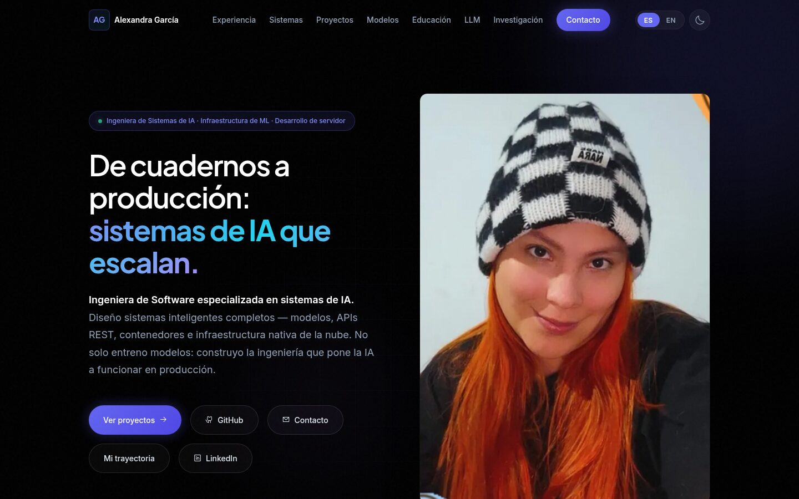
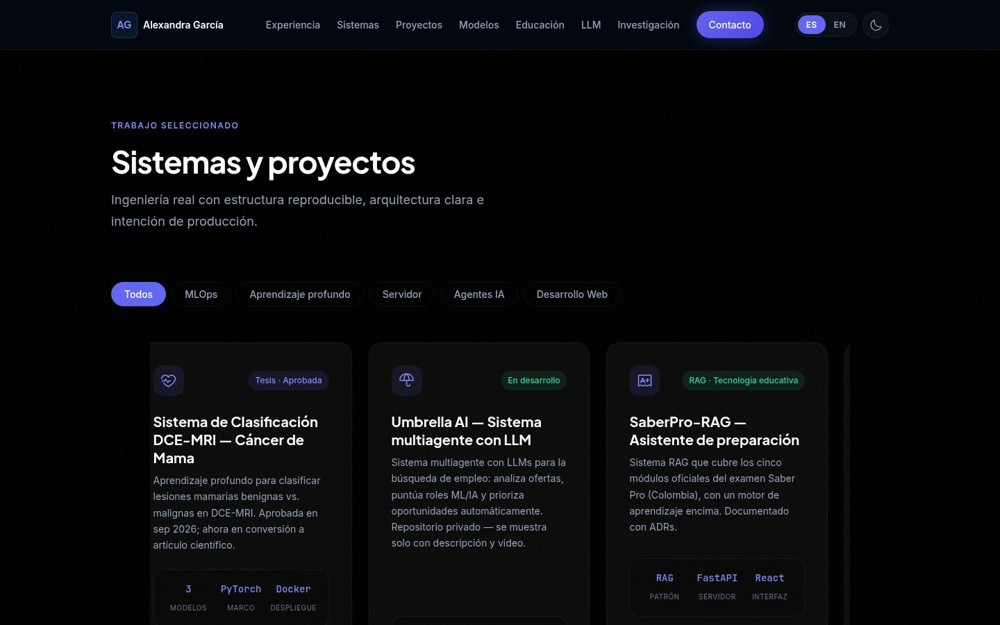
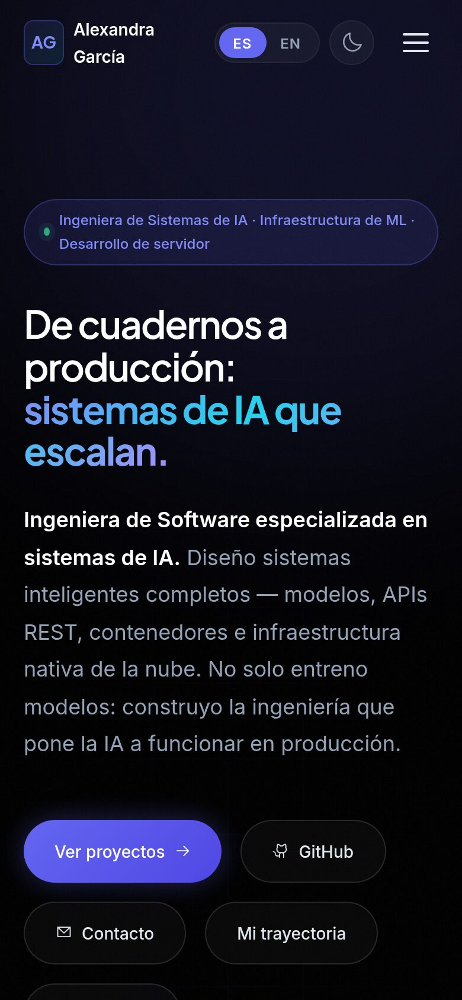
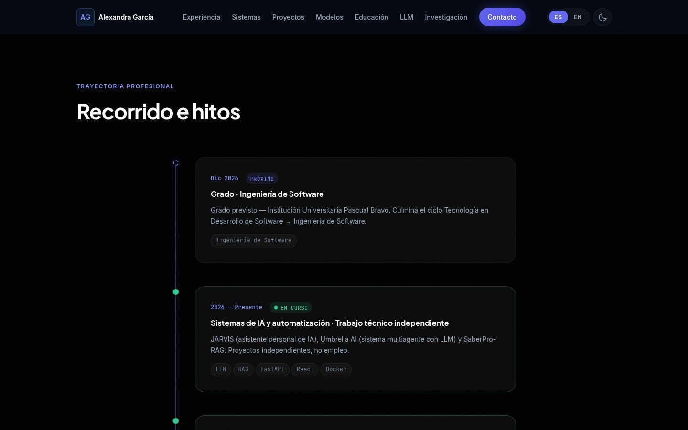
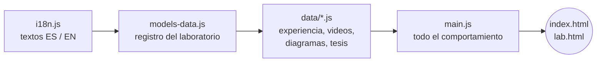

<div align="center">

# Alexandra García

### De cuadernos a producción: sistemas de IA que escalan

Ingeniera de Software enfocada en **aprendizaje automático, visión por computador y sistemas de IA**,
con base sólida en desarrollo de servidor en Java.

[](https://pandorariot.github.io/MiPortafolio/)
[](https://www.linkedin.com/in/alexandragarciabarrioseng)
[](mailto:alexandra.software.engineer@gmail.com)




</div>

---

## ✨ Lo más destacado

| | |
|---|---|
| 🧠 **Tesis DCE-MRI · aprobada (sep 2026)** | Clasificación de lesiones mamarias con ResNet50, EfficientNet-B3 y MobileViT-S en PyTorch. Validación cruzada de 5 particiones, evaluación a nivel de paciente y Grad-CAM. **Modelo final ResNet50: AUC 0,951 · sensibilidad clínica 0,909.** |
| 🔬 **Semillero CognIA** | Modelos predictivos sobre Breast Cancer Wisconsin Diagnostic con Scikit-learn. |
| 🤖 **Sistemas con LLM** | JARVIS (asistente personal de IA), Umbrella AI (sistema multiagente) y SaberPro-RAG (asistente de estudio con RAG). |
| ☕ **Servidor en Java** | Servisoft S.A.: APIs REST y SOAP, MSSQL, Oracle y MongoDB para clientes institucionales y del sector público. |
| 🏆 **3.er lugar · Hackatón ESUMER (dic 2024)** | Hackatón de Arquitectura en la Nube avanzada del Diplomado en Arquitectura en la Nube: infraestructura en AWS con Terraform. |
| 🎓 **Formación** | Ingeniería de Software (grado en dic 2026) y diplomados en Ciencia de Datos, Arquitectura en la Nube e IA — **toda mi formación ha sido con becas por excelencia** (Sapiencia, Presupuesto Participativo, Matrícula Cero y Nodo con Accenture). |

## 🗺️ Qué vas a encontrar en el sitio

```
Portada ─ Métricas ─ Sobre mí ─ Experiencia ─ Filosofía de sistemas ─ Flujo de IA
   │
   ├─ Proyectos (con filtros)          ├─ Laboratorio de modelos (carrusel + fichas)
   ├─ Nube y datos masivos             ├─ Educación
   ├─ Ingeniería de LLM                ├─ Tecnologías
   ├─ Intereses de investigación       ├─ Recorrido e hitos (2026 → 2017)
   └─ Actividad en GitHub (en vivo)    └─ Contacto
```

- 🌎 **Bilingüe de verdad:** el español es 100 % español y el inglés 100 % inglés. Solo se comparten nombres de productos y siglas.
- 🌗 **Tema claro y oscuro**, con animaciones que respetan `prefers-reduced-motion`.
- 📱 **Adaptable:** probado a 375, 768, 1024 y 1440 px.
- 🧪 **Laboratorio de modelos honesto:** nada se marca como entrenado o desplegado si no hay un artefacto real detrás.

## 📸 Capturas

<table>
  <tr>
    <td width="68%"></td>
    <td rowspan="2" width="32%"></td>
  </tr>
  <tr>
    <td></td>
  </tr>
</table>

---

## 🛠️ Cómo está hecho

Sitio estático **sin framework y sin paso de compilación**: HTML, CSS y JavaScript puros, publicado en GitHub Pages.



No hay `package.json` ni empaquetador: las etiquetas `<script>` cargan en ese orden.

### Archivos

```
index.html                   Página principal
lab.html                     Ficha de cada modelo del laboratorio: lee location.hash (#/slug)
                             y renderiza el modelo desde models-data.js
styles.css                   Sistema de diseño original (índigo/azul marino, tarjetas de vidrio,
                             Plus Jakarta Sans + Inter + JetBrains Mono) y, al final, los estilos
                             del carrusel y la ficha del laboratorio con los mismos tokens
main.js                      Comportamiento: idioma, tema, navegación, aparición al hacer scroll,
                             filtros de proyectos, API de GitHub, carrusel y ficha del laboratorio
i18n.js                      Textos EN/ES, incluido el espacio `lab` del laboratorio y el
                             glosario window.I18N_TERMS para etiquetas sin clave
models-data.js               Registro del laboratorio de modelos, bilingüe campo por campo
favicon.svg                  Monograma (índigo sobre azul marino)
data/experience.js           Experiencia laboral e investigación (fuente de la sección Experiencia)
data/cv.js                   Ruta del PDF para el botón «CV» de la portada (pendiente de agregar)
data/videos.js               TODOS los enlaces de YouTube (una clave por cada data-video="…")
data/diagrams.js             Diagramas de arquitectura depurados para los bloques de evidencia
data/thesis-architecture.js  Datos del explorador de la tesis (capas descongeladas, según el repo)
assets/img/                  Fotos del perfil (nunca se recortan: proporción natural)
assets/readme/               Capturas usadas en este README
docs/private/                Copia local del CV y reportes de cambios — ignorado por git, nunca se publica
```

## 🧪 Laboratorio de modelos

Registro de arquitecturas de ML/DL basado en datos. En `index.html` (`#lab`) se muestra como un **carrusel filtrable que avanza solo**, y cada modelo tiene su ficha en `lab.html`.

- Avanza cada ~4,2 s y se pausa al pasar el mouse, al enfocar o al tocar. Con `prefers-reduced-motion: reduce` no avanza solo; las flechas, los puntos y el teclado siguen funcionando.
- Los filtros se generan a partir del campo `type` de los modelos, no están escritos a mano. Si agregas un modelo con un tipo nuevo, aparece un filtro nuevo automáticamente.
- Cada tarjeta tiene espacio para una portada. Mientras no haya imagen real, se genera una provisional con el nombre y el tipo del modelo ("imagen pendiente").
- Cada modelo tiene un `status` honesto: `planned | research | development | trained | deployed`. Hoy `cnn` y `transformer` (MobileViT-S) están entrenados; el resto está `planned` a propósito. No hay resultados inventados.

### Cómo agregar un modelo

Todo vive en **`models-data.js`**, en un solo arreglo: `window.MODEL_LAB`.

1. Copia un objeto existente y llena todos los campos, en **los dos** idiomas (`{ en, es }`) para cualquier texto.
2. `status`: usa `trained` o `deployed` solo si hay un artefacto o una métrica real que lo respalde.
3. `architecture`: lista ordenada de etapas `{ en, es }`; en la ficha se dibuja como un diagrama de flujo.
4. `metrics`: `null` hasta que haya un resultado real reportable. Después: `[{ label: {en, es}, value: '0.xx' }, …]`, con una advertencia en `metricsNote` (tamaño de muestra, intervalo de confianza, etc.).
5. `inference`: `{ input: {en,es}, output: {en,es} }` describe la *forma* de una demostración futura, aunque todavía no exista.
6. `order`: posición de orden (texto con ceros a la izquierda, por ejemplo `'10'`).
7. `cover`: `null` para la portada provisional, o una ruta como `assets/model-covers/<slug>.jpg` cuando exista una captura real (esa carpeta todavía no existe; hay que crearla). El carrusel cambia solo.

### Conectar una API de inferencia real

`ModelLabDetailModule`, en `main.js`, muestra el campo `api` si existe (`model.api`, por ejemplo `/predict`) como una línea `POST` en el panel de inferencia. Para pasar del esqueleto a una demostración real:

1. Levanta el servicio.
2. Define `api` (y `demo`) en la entrada de ese modelo.
3. Extiende `ModelLabDetailModule.render()` para que, cuando `model.demo` exista, muestre un formulario o un campo para subir archivos en lugar del panel estático `.inference-stub`.

No hace falta tocar ningún otro archivo.

## 🚀 Ejecutar en local

No hay paso de compilación; sirve cualquier servidor de archivos estáticos:

```bash
cd portfolio
python3 -m http.server 8765
# → http://localhost:8765/
```

## 📦 Publicar

GitHub Pages publica desde la raíz de la rama `main` (https://pandorariot.github.io/MiPortafolio/). Cada push a `main` vuelve a publicar el sitio.

> [!IMPORTANT]
> Cada vez que cambies un `.css` o `.js`, sube el parámetro `?v=` en `index.html` y `lab.html`. Si no lo haces, el navegador puede seguir mostrando la versión vieja desde la caché.

```bash
git add -A
git commit -m "…"
git push origin main
```

## 📝 Notas de contenido

- El despliegue en Docker del proyecto DCE-MRI es real, pero corre en un servidor prestado por un asesor de la facultad y no está en el repositorio.
- En ningún momento se inventaron empleadores, clientes, certificaciones, métricas ni fechas. Las fuentes de verdad son el perfil de LinkedIn y el CV.
- Los proyectos se presentan como proyectos, nunca como empleo.

<details>
<summary><b>Historial del diseño</b></summary>

<br>

El sitio pasó brevemente por un rediseño editorial completo (paleta y tipografía nuevas, secciones consolidadas, casos de estudio en lugar de tarjetas de proyectos). **Ese rediseño se revirtió a pedido explícito de la autora**, que quería recuperar el diseño original azul marino con tarjetas de vidrio, sección por sección, tal como era. Lo que está publicado es el **diseño original**, con una sola novedad real encima: el **laboratorio de modelos**, adaptado al lenguaje visual original en lugar de introducir un segundo sistema de diseño.

La versión del rediseño editorial sigue en el historial de git (commits `61d0abf`..`8e7ffd2`, antes de la reversión).

</details>

---

<div align="center">

**Construyamos IA en producción y hagamos equipo** · [Portafolio](https://pandorariot.github.io/MiPortafolio/) · [LinkedIn](https://www.linkedin.com/in/alexandragarciabarrioseng) · [alexandra.software.engineer@gmail.com](mailto:alexandra.software.engineer@gmail.com)

<sub>© 2026 Alexandra García · Ingeniera de Sistemas de IA</sub>

</div>
